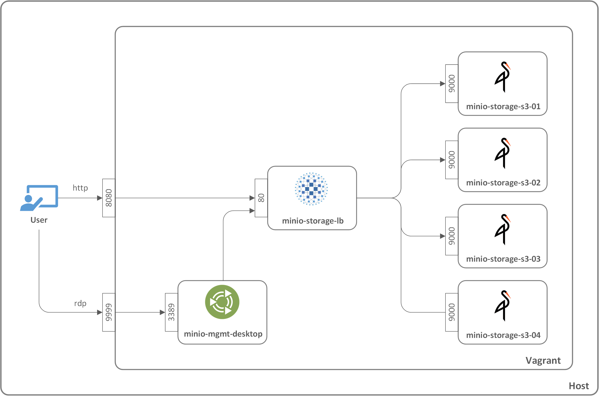

## Vagrant Minio Cluster
Vagrant environment with [minIO](https://min.io/) cluster

### References
  - [Install Minio on Ubuntu 18.04 LTS](https://linuxhint.com/install_minio_ubuntu_1804)
  - [Minio Quickstart Guide](https://docs.min.io/docs/minio-quickstart-guide)

### Application Access
#### Host Access (localhost -> storage nodes)
| Application          | URL                            | Access Key / Secret Key        |
|----------------------|--------------------------------|--------------------------------|
| Minio Server         | http://minio.localtest.me:8080 | minio-admin / minio-admin      |

#### Desktop Access (minio-mgmt-desktop -> storage nodes)
| Application          | URL                            | Access Key / Secret Key        |
|----------------------|--------------------------------|--------------------------------|
| Minio Server         | http://minio-storage-lb        | minio-admin / minio-admin      |

#### Lo in to Desktop
| Application          | URL                            | Username / Password            |
|----------------------|--------------------------------|--------------------------------|
| Ubuntu Mate          | vagrant rdp minio-mgmt-desktop | vagrant / vagrant              |

### Architecture

